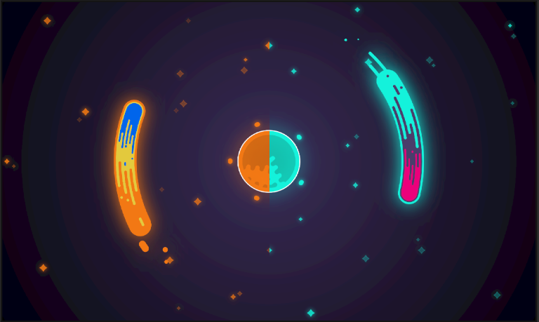

# Cosmic Clock

This a polar clock.
 
From the [Flutter clock repo @ github](https://github.com/flutter/flutter_clock) this clock implements the hour format contained in the  [**Flutter clock helper package**](https://github.com/flutter/flutter_clock/tree/master/flutter_clock_helper) so it is needed in order for it to work properly.
 
 The inspiration for this clock comes from an tutorial to draw a [Flat Style Comet](https://youtu.be/OqYcims5p3Y)

The animations were made using [Flare](https://rive.app/).

 

The [Comet](https://rive.app/a/d-mon/files/flare/comet/embed) is a representation of all of hour, minutes and seconds in one "hand". 

The [Sun](https://rive.app/a/d-mon/files/flare/sun/embed)  is a recursive representation of tens of minutes.

The app switches colors based on the hour of the day, from 6 hours to 17:59 hours it uses a light color scheme dominated by #16f2db while at 18 hours and before 6 hours it uses a light orange color scheme dominated by #f27916

